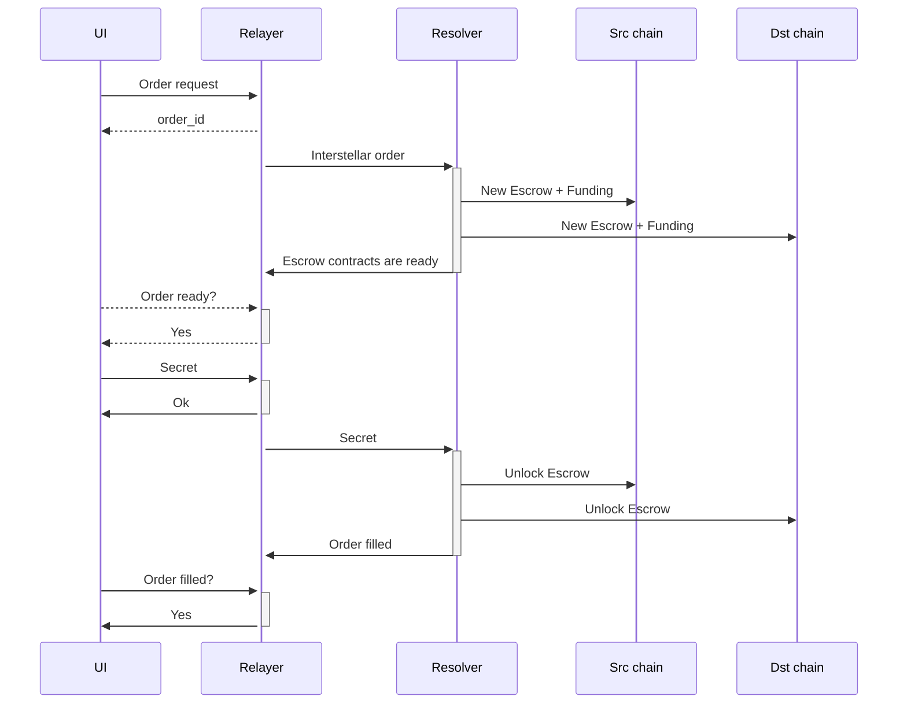

# 🌠 InterStellar 1-inch DEX

[](https://github.com/0xGeorgii/interstellar/actions/workflows/build.yml)
[](https://github.com/0xGeorgii/interstellar/actions/workflows/docker-publish.yml)

## 🌌 Overview

InterStellar is a decentralized exchange (DEX) implemented during the [Unite DeFi](https://ethglobal.com/events/unite) hackathon. It bridges Ethereum and [Stellar](https://stellar.org/) swaps by extending the [1inch Fusion+ protocol](https://github.com/1inch/cross-chain-swap/) to enable seamless EVM ↔️ Stellar swaps. 🚀

## ✨ Features

- **🔄 Cross-Chain Swaps**: Effortlessly swap tokens between EVM-compatible and Stellar networks.
- **🔐 MetaMask & Freighter Integration**: Supports popular wallets for secure transactions.
- **📈 Scalable Architecture**: Built with modular components for easy scaling and maintenance.
- **🐳 Dockerized Deployment**: Simplified setup with pre-configured Docker images and Docker compose configuration.

## 🏗️ Architecture

The project is divided into three main components:

1. **🔧 Relayer**:
   - Backend service for managing cross-chain transactions.
   - Built with FastAPI and Pydantic for robust API handling.
   - Ensures payload integrity and signature verification.
   - Uses Stellar SDK and ethers.js for blockchain monitoring.

2. **🧩 Resolver**:
   - Handles cross-chain order processing.

3. **💻 UI**:
   - React-based frontend for user interaction.
   - Integrates Material-UI for a sleek and responsive design.
   - Features wallet connectors for MetaMask and Freighter.
  
4. **📦 Containers**:
   - Available on [GitHub Container Registry](https://github.com/0xGeorgii?tab=packages&repo_name=interstellar) for easy deployment and scaling.



## 🛠️ Installation

### Prerequisites

- 🐳 Docker & Docker Compose
- 🟢 Node.js (v22+)
- 🐍 Python (v3.12.1+)

### Steps

1. Clone the repository:
   ```bash
   git clone https://github.com/0xGeorgii/interstellar.git
   cd interstellar
   ```

2. Install dependencies:
   - **Backend**:
     ```bash
     cd relayer
     rye sync
     cd ../resolver
     rye sync
     ```
   - **Frontend**:
     ```bash
     cd ui
     npm install
     ```

3. Start services:
   ```bash
   docker-compose up --build
   ```

4. Without building:
   ```bash
   docker-compose -f docker-compose-ghcr.yml up
   ```

5. Access the UI at `http://localhost:3000`.

## 🚀 Usage

### 🔗 Wallet Connection

- **🦊 MetaMask**: Connect your Ethereum wallet for ETH → XLM swaps.
- **🌟 Freighter**: Connect your Stellar wallet for XLM → ETH swaps.

### 🔄 Token Swap

1. Select the token pair (e.g., ETH → XLM).
2. Enter the amount to swap.
3. Sign the transaction using your wallet.
4. Submit the order and monitor the status.

## 📚 API Documentation

The backend services expose RESTful APIs for order creation and management. Key endpoints include:

- **Relayer**:
  - `POST /order`: Submit a new order.
  - `POST /secret`: Submit a secret for order finalization.

- **Resolver**:
  - `GET /health`: Check service health.

## 🧑‍💻 Development

### Running Locally

1. Start the backend services:
   ```bash
   cd relayer
   uvicorn src.relayer.main:app --reload
   cd ../resolver
   uvicorn src.resolver.main:app --reload
   ```

2. Start the frontend:
   ```bash
   cd ui
   npm run dev
   ```

### Testing

- **Backend**:
  ```bash
  pytest
  ```
- **Frontend**:
  ```bash
  npm test
  ```

### EVM Deployment

1. 1inch cross-chain swap contracts ready for deployment are located in the [`evm`](./evm) directory.

#### Sepolia deployed contracts:

- TODO

### Stellar Deployment

1. Stellar smart contracts are located in the [`soroban-htlc`](./soroban-htlc/contracts) directory.
2. Detailed documentation can be found in the docstrings of the contracts.
3. To deploy, use the Stellar CLI to upload the contracts to the Stellar network.
4. Deployments scripts are available in the TODO directory.

#### Stellar deployed contracts:

- TODO

## 🤝 Contributing

We welcome contributions! Please follow these steps:

1. Fork the repository.
2. Create a new branch:
   ```bash
   git checkout -b feature/your-feature-name
   ```
3. Commit your changes:
   ```bash
   git commit -m "Add your message here"
   ```
4. Push to your fork and create a pull request.

## 📜 License

This project is licensed under the MIT License. See the [LICENSE](./LICENSE) file for details.

## 🙌 Acknowledgments

- To [1inch](https://1inch.io/), [Stellar](https://stellar.org), and [ETHGlobal](https://ethglobal.com) for organizing the hackathon.
- Powered by Stellar SDK, ethers.js, and Material-UI.
- Built with ❤️ and 🌠 by [0xGeorgii](https://github.com/0xGeorgii).
